# Actividad 02: HTTP en la práctica

En esta actividad vamos a explorar algunas formas de inspeccionar requests HTTP. Si bien no son las únicas, permiten dar una idea de cómo se realiza la comunicación entre cliente y servidor en la Web

## Postman

La primera forma que veremos es utilizando una aplicación llamada [Postman](https://www.postman.com/). Si bien en su sitio web se presentan como una plataforma colaborativa para desarrollo de APIs, el uso más básico que uno le puede dar es realizar requests HTTP. Es recomendable que aprendan a utilizarla desde ya, pues en la segunda parte del curso (construcción de APIs) les puede ser bastante útil.

Para descargar la app de escritorio, pueden [presionar aquí](https://www.postman.com/downloads/). Una vez que la instalen y la abran, si bien probablemente puedan comenzar a utilizarla inmediatamente, es recomendable crear una cuenta. Es gratis con el plan "Free", y les permite guardar los requests que van haciendo.

Al entrar a la aplicación, verán una vista como la siguiente.

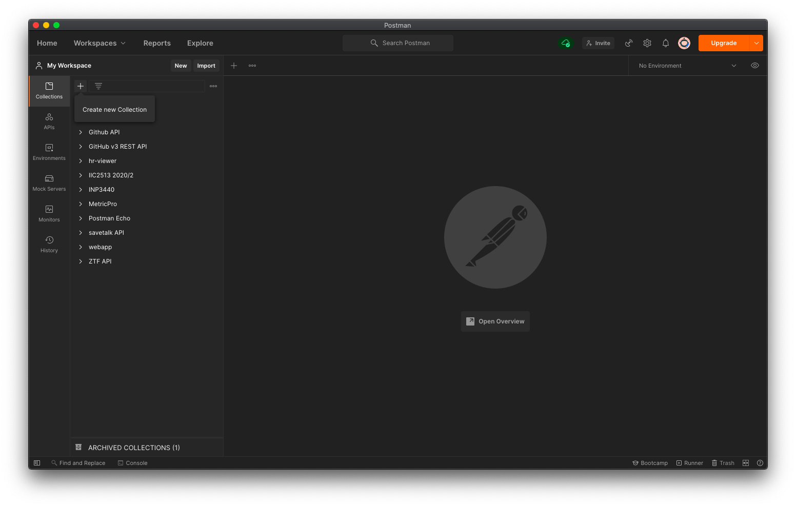

Lo primero que haremos será crear una colección, que nos servirá para organizar los requests que vayamos haciendo. Le pondremos como nombre "Actividad 02 IIC2513" (las imágenes dicen "Actividad 01" por error). Esto se puede hacer presionando en "New collection" y luego especificando el nombre.

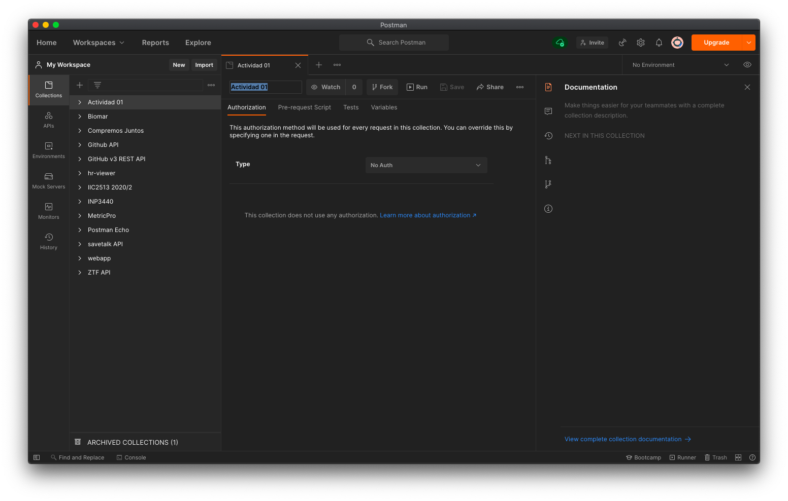

### Primer request

Crearemos un primer request al que debemos darle un nombre (para que Postman lo almacene). Usemos el nombre "Sitio web prueba". Para eso, debemos hacer click derecho en el nombre de colección y presionar "Add request". Los datos del request serán los siguientes:

- Method: `GET`
- URL: [https://untitled-sc76scbab3k5.runkit.sh/](https://untitled-sc76scbab3k5.runkit.sh/)

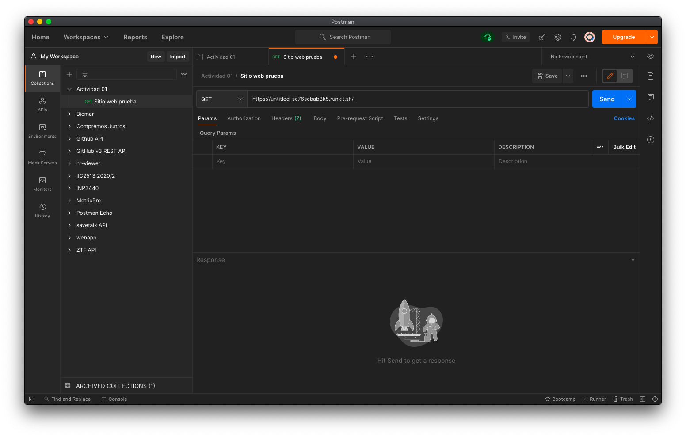

Presionamos "Send" y podemos ver la respuesta en la parte inferior de la ventana.

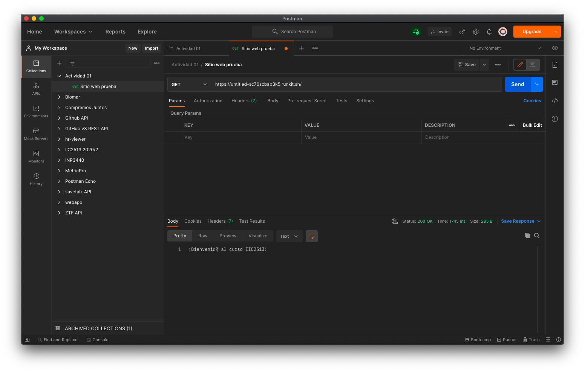

Podrán ver algunas pestañas que incluyen información como los Headers del response. Postman los muestra como una tabla para facilitar la lectura.

¿Y si queremos ver el request y response HTTP "en bruto", tal cual lo vimos en clases?

Ahí es posible abrir la "Developer Console" desde `View → Show Postman Console`. Se abrirá una nueva ventana donde se podrá visualizar el request ya hecho (y también posteriores que se hagan).

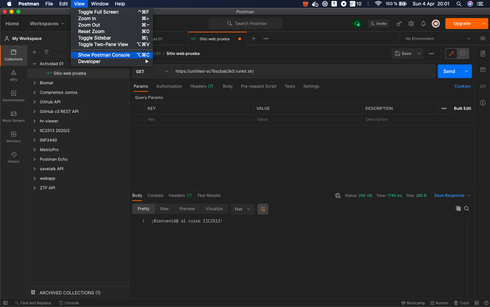

Al extender el detalle del último request, aparecerán datos del request y response. Nuevamente están algo formateados para leerlos de forma más simple. Sin embargo, si uno presiona a la derecha en "Show raw log", podrá ver ambos mensajes HTTP en bruto.

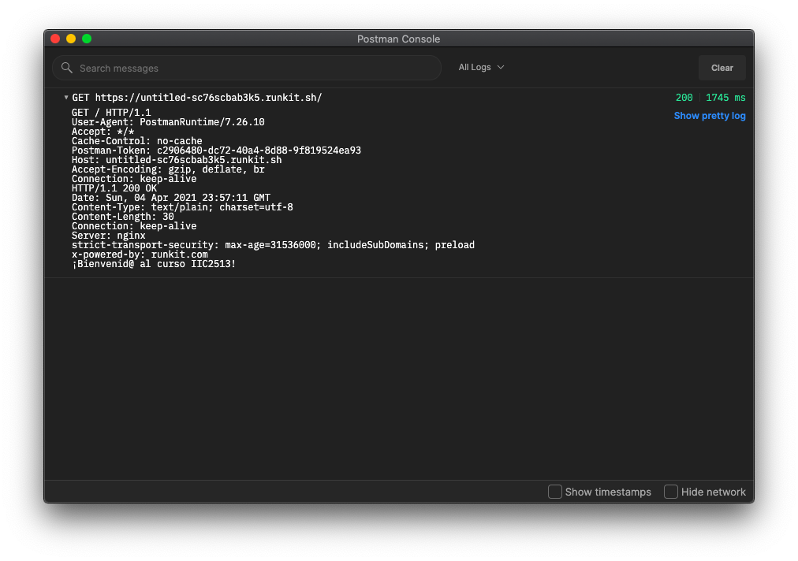

Lamentablemente toda la información está junta, por lo que no es tan fácil distinguir request y response, sin embargo, efectivamente está toda la información ahí. El request comienza con la línea que parte con "GET / HTTP/1.1" mientras que el response comienza con la línea que parte con "HTTP/1.1 200 OK". En cuanto al response, Postman no muestra la línea en blanco que separa headers de body, sin embargo, esa línea **es parte del protocolo**.

El body del response anterior viene en texto plano. Veamos algunos casos en que otros formatos son utilizados.

### Request HTML

Vamos a acceder a la página del DCC, cuyo response incluye un documento HTML. Creemos un nuevo request en Postman llamado "Página DCC". Los datos para este request son:

- Method: `GET`
- URL: [https://dcc.ing.puc.cl/](https://dcc.ing.puc.cl/)

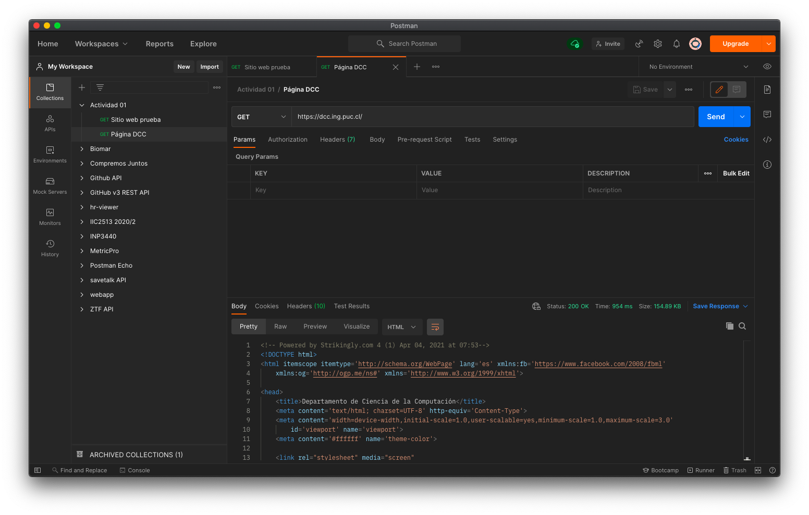

Podemos ver que el body del response incluye el documento HTML asociado a la página. Si revisamos el "Developer Console", podemos ver que incluye el header `Content-Type` con valor `text/html`.

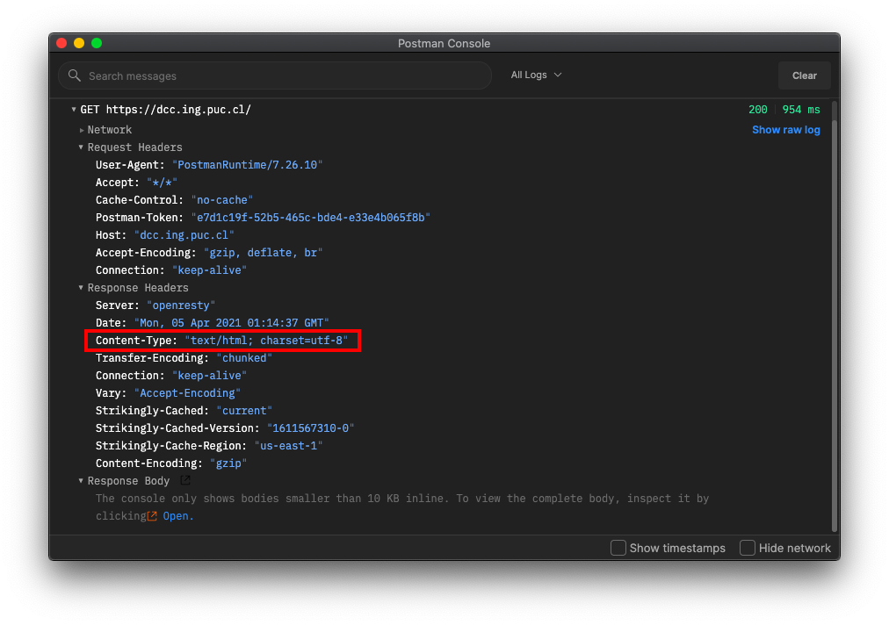

### Requests JSON

Finalmente, hagamos un par de requests más a un recurso que representa un usuario de algún sistema. Utilizaremos el sitio [JSONPlaceholder](http://jsonplaceholder.typicode.com/) que nos permite obtener un recurso ficticio como el recién mencionado. Como el nombre lo indica, este sitio disponibiliza varios recursos que se manejan con el [formato JSON](https://www.json.org/json-en.html). Más adelante en el curso veremos más en detalle este formato, pero por el momento sólo necesitan saber que permite representar e intercambiar datos estruturados en formato key/value.

#### Listar usuarios

Haremos un request para listar los usuarios de una plataforma ficticia, el cual podemos guardar como "Listar usuarios". Los datos son los siguientes:

- Method: `GET`
- URL: [http://jsonplaceholder.typicode.com/users](http://jsonplaceholder.typicode.com/users)

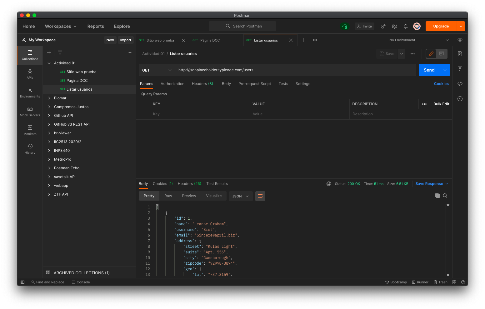

Podemos ver que el body del response está en formato JSON. Analicemos brevemente los headers:

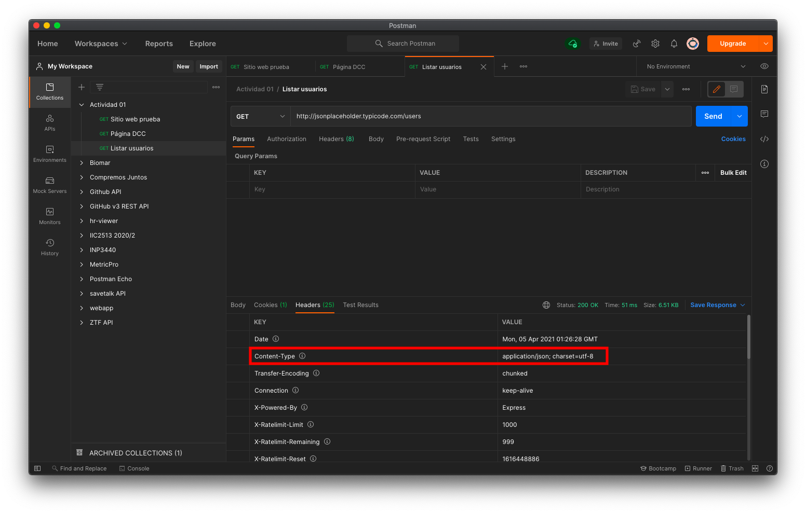

Vemos que, además del body del response, los headers incluyen uno llamado `Content-Type` con valor `application/json`. Este header le permite saber al cliente cómo interpretar el response. Si el cliente es un browser, podría por ejemplo desplegarlo de forma especial (Firefox lo hace de hecho)

#### Crear usuario

Haremos un último request, esta vez para crear un usuario de una plataforma ficticia, el cual podemos guardar como "Crear usuario". Cuando creamos un recurso, tenemos que entregar los datos del nuevo recurso en el body del request (lo que se conoce como "entity"). Los datos del request son:

- Method: `POST`
- URL: [http://jsonplaceholder.typicode.com/users](http://jsonplaceholder.typicode.com/users) (misma URL que para obtener lista 👀)
- Request body (formato JSON)

    ```json
    {
        "name": "Nuevo usuario",
        "username": "usuario",
        "email": "usuario@uc.cl"
    }
    ```

Para especificar un body en el request, se debe presionar la pestaña "Body" bajo la barra con la URL y seleccionar "raw", con lo que aparece una pequeña opción a la derecha que dice "Text". Presionamos esa opción y elegimos "JSON". En el área de texto podemos escribir el body del request en formato JSON, tomando lo indicado un poco más arriba.

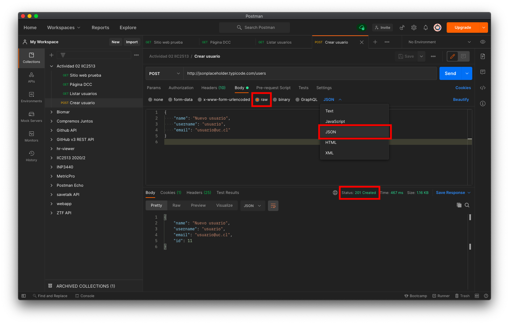

Luego de presionar "Send", podemos ver que el nuevo recurso se creó, porque el status del response es "201 Created". Además nos muestra los datos del nuevo usuario recién creado, incluyendo el "id" asignado.

Veamos cómo se ve este par request/response en bruto en la "Developer Console".

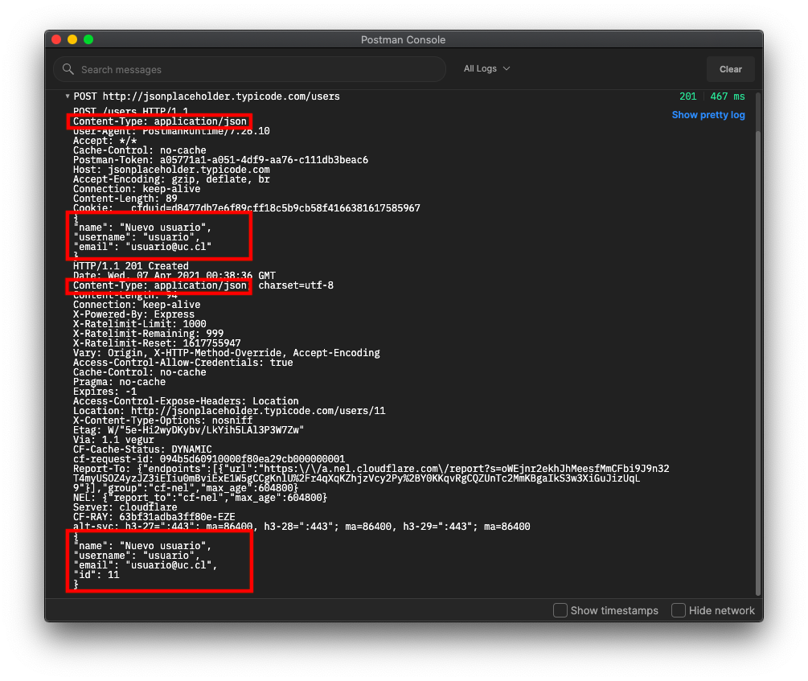

Podemos ver que el request incluye el header `Content-Type: application/json`, sin embargo, nosotros no agregamos explícitamente ese header. Lo que sí hicimos fue configurar el body como "raw" y "JSON". Postman adjunta el header asociado al seguir ese procedimiento. También podemos ver que el body del request se adjunta como texto, tal cual nosotros lo escribimos. El servidor es quien debe interpretar que ese body es JSON gracias al header `Content-Type`.

El response, al igual que en el caso pasado, incluye el header `Content-Type: application/json` y el body con los datos del nuevo usuario.

Todo request que incluya un body sigue un proceso similar al que acabamos de realizar (sea `POST`, `PUT` o `PATCH`).

## DevTools

La segunda forma de realizar requests que veremos es utilizando un browser directamente. Si bien en el browser nos vemos limitados a hacer sólo requests HTTP con método `GET` en caso de hacerlos de forma voluntaria, sí podemos "inspeccionar" todos los requests que ocurren al solicitar un recurso. Para esto utilizaremos las "Developer Tools" o "DevTools" que incluyen la mayoría de los browsers modernos.

A continuación pueden encontrar links a la documentación de las DevTools de Chrome y Firefox, si tienen dudas de cómo activarlas:

- [Chrome DevTools](https://developer.chrome.com/docs/devtools/)
- [Firefox Developer Tools](https://developer.mozilla.org/en-US/docs/Tools)

En ambos casos, un shortcut para abrir las DevTools debiera ser `Command + Option + I` en Mac o `Ctrl + Shift + I` en Windows y Linux.

Al abrir una nueva pestaña y abrir las DevTools verán algo como lo siguiente:

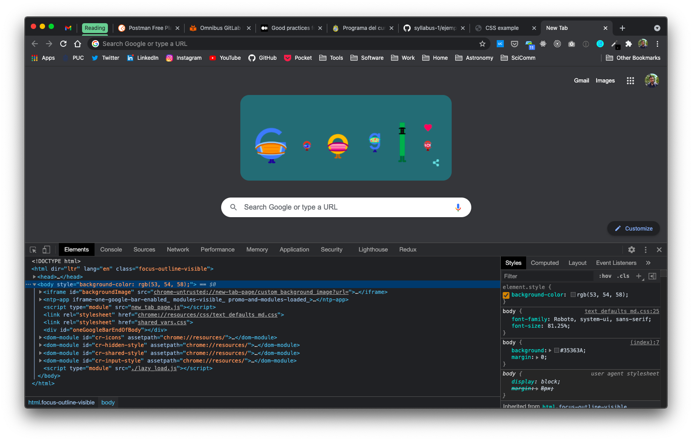

Pueden presionar la pestaña "Network". Ahí es donde podemos inspeccionar requests HTTP. Vamos a hacer un request a la página del DCC nuevamente, con las DevTools abiertas en la pestaña "Network".

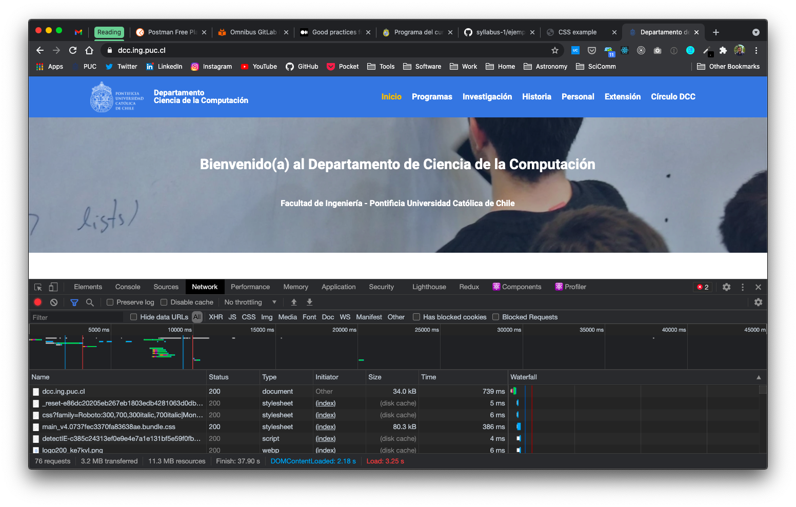

Probablemente vieron que se comenzó a llenar una lista en la parte inferior de la pantalla. Esta lista constituye **TODOS** los requests que se realizan para cargar la página de inicio del DCC. Como vimos en clases, el documento HTML es producto del request inicial, sin embargo, este puede contener referencias a otros recursos (CSS, JavaScript, imágenes, etc).

Si hacen scroll por la lista, verán a la parte derecha una sección llamada "Waterfall". Como el nombre indica, es una especie de "cascada" cuyo eje horizontal es el tiempo, y nos permite ver métricas del tiempo que se demoró cada uno de los requests (para lo cual es necesario hacer hover sobre las barras).

Al presionar sobre el primer request, podemos ver un resumen del request/response (URL, método HTTP, response status code, entre otros).

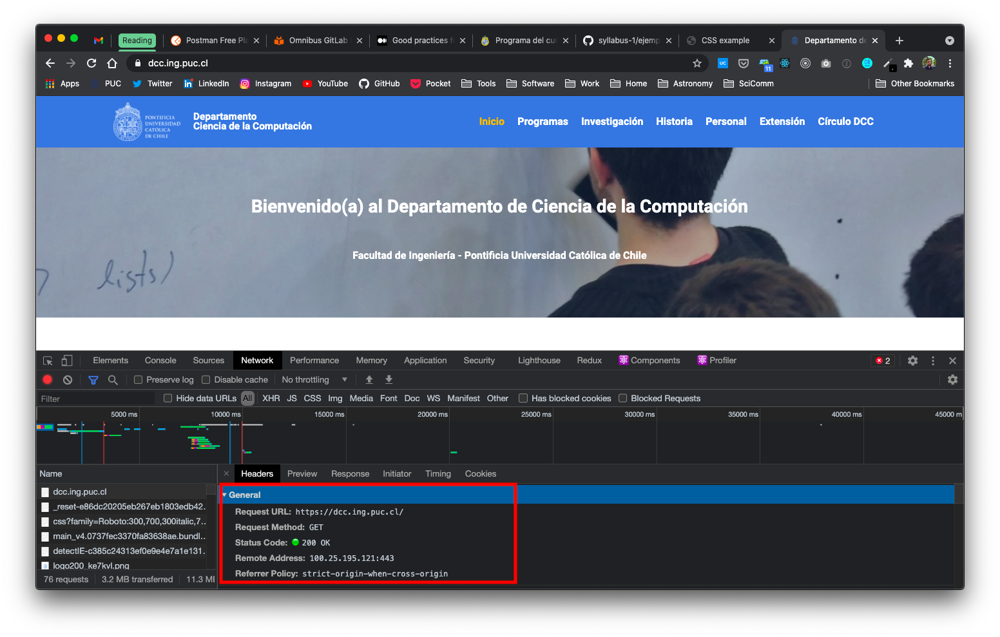

Por último, al hacer scroll podemos ver información de los headers del response, headers del request, y eventualmente del request body (cuando es un request POST, que podría ser resultado de hacer submit de un formulario, por ejemplo).


Esta herramienta es bastante útil para saber todas las interacciones que realiza un sitio web y eventualmente permite identificar problemas de performance (por ejemplo, una imagen podría ser muy pesada y está haciendo que el sitio se demore mucho en cargar). Además individualmente es posible analizar lo que uno envía a y recibe desde un servidor.

Con lo anterior ya pueden analizar requests y responses HTTP utilizando herramientas como Postman y las DevTools de los browsers. Esto les servirá al desarrollar sus futuras aplicaciones web 😎